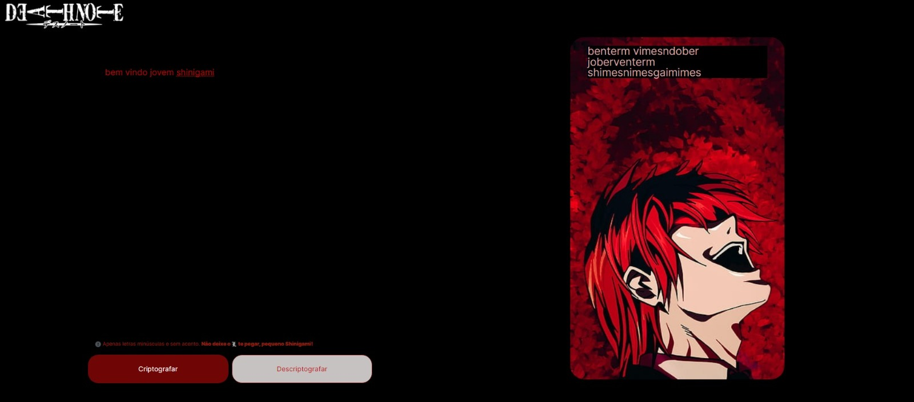

<h1 align="center"> Challenges - ONE </h1>

Esse projeto foi um desafio proposto pela Alura em parceria com a Oracle no programa One.  

  <a href="#-tecnologias">Tecnologias</a>&nbsp;&nbsp;&nbsp;|&nbsp;&nbsp;&nbsp;
  <a href="#-projeto">Projeto</a>&nbsp;&nbsp;&nbsp;|&nbsp;&nbsp;&nbsp;
  <a href="#-layout">Layout</a>

 

  

## 📖 Tecnologias

Esse projeto foi desenvolvido com as seguintes tecnologias:

- HTML e CSS
- JavaScript
- Git e Github
- Figma
- Visual Studio Code

## 🍎 Projeto

Esse projeto tem a finalidade de codificar e decodificar mensagens para que o L não descubra quem é o Kira!

- [Visite o projeto online](kaysilvha.github.io/Desafio_alura/)

  

## 🔖 Layout

Você pode visualizar o layout do projeto proposto através [DESSE LINK](https://www.figma.com/file/tvFEYhVfZTjdJ5P24RGV21/Alura-Challenge---Desafio-1---L%C3%B3gica?node-id=0-1&t=GLrdT3MTW1mr7QuY-0). É necessário ter conta no [Figma](https://figma.com) para acessá-lo.

  

